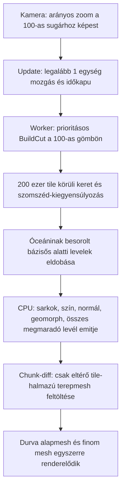

# Zoom közbeni felszínrészletesség — diagnózis

Dátum: 2026-09-11. Hatókör: a jelenlegi működés vizsgálata, javítási javaslatok és várható hatásuk. **A viewer és a Core működésén nem változtattam.**

## 1. Megállapítás

A felhasználó által leírt jelenségnek több, egymást erősítő, a kódban azonosítható oka van. Nem indokolt újabb általános budget-/maxLevel-emeléssel kezdeni.

A legfontosabb felismerés: **a felosztott tile nem feltétlenül jut el a képernyőig**. Előfordul, hogy a rendszer kiválasztja, majd egy elavult modellből származó óceánbesorolás miatt eldobja; máskor a finom geometria elkészül, de a megmaradó durva alapfelszín eléje kerül. Emellett a kamera mozgásküszöbe késlelteti a frissítést, a chunk-diff nem követi a geometria összes változását, és a budget kimerülésekor a kiválasztás egész területeket ejthet vissza alapfelbontásra.

**A probléma javíthatónak látszik, de a „minden zoomon részletes és közben gyors” eredmény több összehangolt javítást igényel.** A jelenlegi számszerű bizonyítékok alapján a részletességet ma nem pusztán a gép teljesítménye korlátozza: a már elvégzett munka egy része sem válik látható részletté. Ennek megszüntetése kedvezőbb első cél, mint még több tile előállítása.

### Bizonyítékok erőssége

- **Kód alapján bizonyított:** végrehajtási ág, scene-beállítás, kizárás, cache-/chunk-viselkedés.
- **Önálló próbával reprodukált:** a tényleges, linkelt kvadfa/chunk kód eredménye; a Core mezőiből számolt geometriai ellenpéldák.
- **Meglévő Unity-naplóval alátámasztott:** az adott korábbi futás tile-számai és feltöltési ideje.
- **Élőben még ellenőrizendő:** az egyes okok részesedése a felhasználó által látott képhibából, valamint a javasolt javítások utáni kép és FPS.

Ebben a vizsgálatban nem készült új, általam vezérelt Unity Editor-képi ellenőrzés, Frame Debugger-felvétel vagy javítás utáni teljesítménymérés. A geometriai minták százalékai **nem képernyőpixel-arányok**, és a .NET-próba ideje **nem Unity frame-idő**.

## 2. A tényleges kiinduló állapot

Branch: `codex-handoff`, HEAD: `0d993f4`; a `feature/camera-view-modes` ugyanitt áll. Az `experiment/full-temperature-model` külön testvérág. A munkapéldányban már a vizsgálat előtt módosított volt többek között a scene, a `PlanetGridMesh.cs`, a solution és a dokumentáció. Az elemzés a munkapéldányt olvassa, nem kizárólag a HEAD-et. A korábbi változtatásokat megőriztem.

A mentett `PlanetView.unity` fontos értékei:

| Beállítás | Mentett érték | Következmény |
|---|---:|---|
| `radius` | 100 | A LOD-geometria referencia-gömbje. |
| `level` / `adaptiveBaseLevel` | 5 / 8 | A világ referencia-mezője és a statikus render eltérő felbontású. |
| `adaptiveMaxLevel` | 20 | A mélységplafon már magas. |
| `targetTilePixelSize` | 12 | A kódbeli 48-as inicializálást felülírja. Ez közelítő tile-átmérő-cél, nem garantált képi hibakorlát. |
| `adaptiveRenderBudget` | 200 000 | Dinamikus cut-keret; nem idő- vagy ténylegesen látható mesh-keret. |
| `useAsyncMeshRebuild` / `useChunkedDynamicMesh` | be / be | Háttérszálas számítás és részleges terep-feltöltés. |
| `dynamicChunkLevel` | **6 → ténylegesen 8** | A `Math.Clamp(6, 8, 20)` miatt 8; a kódbeli új default, 11, nem érvényesül. |
| `adaptiveCameraMoveThreshold` | **1** | Abszolút Unity-egységben méri a mozgást, zoomtól függetlenül. |
| `minSecondsBetweenAdaptiveRebuilds` | 0,1 s | Az indítás legfeljebb kb. 10 Hz; a teljes frissítés ennél lassabb is lehet. |
| `geomorphRangeFraction` | 0,6 | A szülő és a finom felszín közötti átmenet széles tartományban történik. |
| `dynamicLayerRadialBias` | 0,002 | A dinamikus réteg kismértékű kifelé tolása. |
| `useGpuClassification` / `useGpuGeometry` | **be / ki** | GPU-alapú bázisbesorolás, de CPU-s sarokgeometria és aszinkron finomítás. |
| `elevationScale` / `terrainReliefExaggeration` | 0,001 / 1,5 | A tényleges felszín nem a 100 sugarú gömb. |
| kamera `distance` / `minDistance` | 300 / 100,1 | A kamera az origó felé néz; közelségét a referencia-sugárhoz korlátozza. |
| `showBorders` / `showClouds` | ki / ki | A mentett konfigurációban ezek nem magyarázzák a felszín blokkosságát. |

A scene nem bizonyítja a pillanatnyi Inspector-állapotot. A legutóbbi helyi napló (`PerfLog_20260911_111620.txt`) a 12 px célt, base 8/max 20 értékeket és GPU classification be / GPU geometry ki állapotot külön megerősíti. A napló még a korábbi hydrology-logformát használja, ezért a most módosított munkapéldány pontos bináris azonossága nem állítható; történeti futásbizonyítékként kezelendő.

## 3. Hogyan lesz a zoomból felszín?



A `BuildStaticBaseLayer()` egyszer felépít **393 216** L8 tile-t a teljes gömbön. A négy sarok színe és normálja interpolálódik a két háromszögön, ezért távolról részletes, folytonos felületnek látszik. Közelítéskor viszont a geometria és a felületi adatminták korlátozott sűrűsége láthatóvá válik.

A kvadfa alacsony, L3 gyökerekről indul. A mai aktív út a `SelectCutPrioritized`, nem a régi `Visit()`-alapú DFS. A prioritása és osztási döntése `atan2(rTile, distance)`; **a korábbi `1/cosGrazing` szorzó és a fél-ív küszöb nem vezérli ezt az aktív döntést**. Ezek szerepét a történeti ND-46 szöveg és több megmaradt komment túlhangsúlyozza. A kiválasztó nem vizsgálja, hogy van-e fraktálzaj az adott tile-ban.

## 4. A fő hibamechanizmusok

### 4.1. Eltérő domborzatmodell alapján tiltódik le a finomítás — kiemelt prioritás

A `TileClassification.compute` `BaseElevationF()` függvényéből hiányzik a Core-ban meglévő `SecondaryDetailNoise`. Ez nem feltételezés: a shader 521. sorától külön komment indokolja a kihagyást, a 547. sor visszatérési képletében valóban nincs benne a tag. A CPU `CrustElevation.BaseElevation()` viszont hozzáadja, 900 m kontinentális amplitúdóval, regionális hullámzásként.

Az aktív scene-ben a bázis-tile-ok besorolása GPU-n készülhet, míg sarkaik magassága a teljes Core-modellből. Az aszinkron dinamikus út CPU-n számol, de **még a saját klasszifikációja előtt** meghívja az `IsBaseAncestorOceanic()` szűrőt. Ha a bázisős GPU-eredménye óceáni, minden leszármazott kimarad.

Ez azt jelenti, hogy egy a teljes modell szerint szárazföldi területet egy másik, hiányos magasságmodell óceáninak minősíthet, majd ez a megjelölés megakadályozza a zoomos finomodását. Ez sokkal erősebb hatás, mint a shader kommentjében szereplő „valamivel simább” felszín.

**Számszerű kontroll:** a scene seedjével, t=0-nál, 6144 szabályosan elosztott L8 középpontot vizsgáltam. A teljes Core-modell szerint 2139 szárazföldi; csak a másodlagos tagot elhagyva **1255/2139, azaz 58,7%** a tengerszint alá kerül. Fordítva 4/4005 pont változik. Ez **nem GPU-futtatás vagy a GPU teljes reprodukciója**: a hiányzó modelltag önálló hatását méri azonos double számolás mellett. A tényleges GPU-eltéréshez külön GPU/CPU mintapárosítás kell.

**Várható javítás:** a finomítás engedélyezését a hiteles Core-besorolásból vagy konzervatív mezőhatárokból vezetni. A GPU classification kikapcsolása + teljes újraépítés jó elkülönítő próba, de önmagában nem végleges optimalizáció: a régi cache-t törölni kell, és a bázis besorolásának költsége változik. Egy helyes GPU-port csak külön paritás- és fordításvizsgálat után jöhet szóba.

**Vizuális hatás:** az indokolatlanul L8-on maradó szárazföldi foltok jelentős része finomodhat. **Teljesítményhatás:** a korábban kihagyott geometriát ténylegesen elő kell állítani; ezért a helyességi javítást a renderköltség csökkentésével együtt kell megtervezni.

### 4.2. A durva alapfelszín eltakarhatja a finomabbat — kiemelt prioritás

A bázis terepmesh a finomítás után is teljes egészében megmarad. Nincs olyan fedettségi maszk vagy indexfrissítés, amely a lecserélt bázisrészt eltávolítaná. A finom réteg csak `0.002` egység sugárirányú eltolást kap. A felszín shaderének típusa opak; a közelebbi geometria takar.

Egy durva háromszög áthidalhat egy völgyet. Ha a finom mintavétel ezt a völgyet lefelé bontja ki, a finomabb felszín a durva háromszög **mögé** kerül. Több subdivision ezt önmagában nem javítja: a helyes, részletes völgy még mindig takarásban van.

**Geometriai ellenpélda a jelenlegi Core-mezővel:** a fenti 6144-es mintából 2139 szárazföldi középpont esetében összevetettem a bázis két háromszögének sugárirányú metszését a finom középpont sugarával, a 0,002 bias hozzáadása után. **1023 pontnál, 47,8%-nál a bázis maradt kívül.** Az érintett pontoknál a fennmaradó eltérés mediánja 0,02868, maximuma 0,21515 Unity-egység.

Konkrét ellenpélda: `face=0, level=8, u=0, v=32`; bázis sugara a mintairányban **102,188495**, finom felszín + bias **102,152498**. A durva felület kb. **0,036** egységgel még mindig kívül van. A modell t=0, a scene tengerszintje 1648,048745 m, az eltolási skála 0,001, relief-szorzó 1,5. A próba double geometriai referencia, nem Unity-float vagy GPU-depth pixelteszt; a takarás lehetőségét bizonyítja, a képi arányát nem.

**Várható javítás:** a finom réteg az általa lefedett durva részt váltsa fel. A régi fedés addig maradjon, amíg az új patch és szükséges határai készen vannak; az átadáskor ugyanarra a felszíndarabra egyetlen terepreprezentáció maradjon. Ez chunkolt bázist, fedettségi állapotot és ellenőrzött szülő–gyerek átadást igényel. Az egész alapgömb kikapcsolása nem elfogadható megoldás.

**Vizuális hatás:** a már kiszámolt finom relief végre láthatóvá válhat, megszűnhetnek a durva/fine takarási foltok. **Teljesítményhatás:** újabb tile-szaporítás nélkül javíthat a képen, csökkentheti a kettős rajzolást; a bázisfelosztás és fedettségváltás saját CPU-/draw-call-költségét mérni kell. A bias további emelése torzítaná a felszínt és más rétegek illeszkedését, ezért nem javasolt végleges megoldásként.

### 4.3. A mozgásküszöb közeli zoomnál hosszú időre befagyaszthatja a LOD-ot

Az `Update()` csak akkor indít új kiválasztást, ha a kamera a legutóbbi cuthoz képest legalább **1 Unity-egységet** mozdult, vagy az adaptív konfiguráció dirty. A zoom viszont a magasságot arányosan csökkenti. Például a `distance=101.1 → 100.2` közelítés csak 0,9 egység mozgás, miközben a referenciafelszín feletti magasság 1,1-ről 0,2-re esik: a közel sík felszín vetített mérete kb. **5,5-szeresére** nőhet frissítés nélkül. Ha a mozgás itt megáll, az idő múlása önmagában nem indítja el a kimaradt finomítást.

A példa a kódbeli 100-as referencia-gömbre vonatkozik; a tényleges felszín magasabban is lehet, lásd 4.7. Ugyanez a relatív hiba bármely olyan terepfelszín közelében felléphet, ahol az 1 egység nagy a tényleges kamera–felszín távolsághoz képest.

Az érvénytelenségi feltétel külön nem figyeli a kamera FOV-ját, képméretét/aspectjét vagy helyben változó nézési irányát. A normál orbit során a pozíció is változik, de ablakátméretezéskor vagy más kameravezérlésnél ez külön hiányosság.

**Várható javítás:** vetített elmozdulás-/méretváltozás-alapú indítás, nézetparaméterek teljes követése, és a mozgás végén garantált végső frissítés. Kiinduló hangolási kísérlet lehet néhány százalék relatív méretváltozás; a végleges határ képi méréstől függjön. A sebesség védelmét a háttérmunka és feltöltés időkerete adja.

**Hatás:** hamarabb reagáló, megállás után biztosan beélesedő felszín. Több frissítési igény keletkezik, ezért a küszöb egyszerű nullázása önmagában ronthatja a terhelést.

### 4.4. Az óceáni bázisős teljes leszármazási ága kimarad — helyes besorolás mellett is

A 4.1 szerinti modellhiba nélkül is túl erős szabály egyetlen L8 középpont óceáni állapotából az összes finomabb pontot kizárni. Egy ilyen cellának lehet szárazföldi sarka, partvonala vagy kisebb szigete. A próba **4005 óceáni középpontú cellából 233-nál** talált legalább egy szárazföldi sarkot. A később megjelenő összes leszármazott tiltása tehát a valós Core-modellben sem konzervatív.

A kvadfa ráadásul nem ismeri ezt a kizárást: előbb elvégzi a finomítást és felhasználja a keretet, csak az emit előtt derül ki, hogy a tile nem lesz renderelve. A nyílt víz ugyanakkor mindvégig a bázisfelbontáson maradhat.

**Mai Unity-futásból:**

| Kickoff kamera-távolság | Kiválasztott tile | Dinamikus render-tile | Mesh-feltöltés |
|---:|---:|---:|---:|
| 145,254 | 3764 | 1780 | 15,44 ms |
| 130,000 | 42 100 | 8580 | 45,15 ms |
| 130,000, más irány | 34 956 | 6648 | 44,39 ms |
| 130,000, más irány | **45 316** | **5864** | **37,17 ms** |

Forrás: `unity/WorldGenViewer/Logs/PerfLog_20260911_111620.txt`, 198–207. Az utolsó sorban **87,1%** nem jutott el a dinamikus levélhalmazig. Az aktív statikus mód minden cut-levele L8 fölötti, így a kódban a különbséget az óceániős-szűrő magyarázza. A szám nem azt jelenti, hogy a képernyő 87,1%-a hibás vagy szárazföld: sok kiválasztott tile valóban óceáni, esetleg látómezőn kívüli is lehet. Viszont bizonyítja, hogy itt **nem a 200 000-es keret telítődése volt a kötő korlát**.

**Várható javítás:** külön kezelni a nyílt mélyvíz, partmenti vegyes patch és szárazföld részletigényét. Biztosan elhagyható területet már a kiválasztáskor felismerni, konzervatív magasság-/vízmélység-információból. A part finomodását garantálni. A vízfelszín részletessége saját képi hibacélhoz köthető; nem szükséges minden mélyvízi aljzatot a szárazföld költségével felépíteni.

### 4.5. Budget-kimerüléskor nem megfelelő a durvább helyettesítés

A `SelectCutPrioritized()` csak a már véglegesített `result.Count` mennyiséget korlátozza. A felbontott, de még sorban álló levelek nincsenek beleszámolva. Amint a result eléri a keretet, a ciklus `break`-kel kilép, és **a prioritási sor többi része elvész**. Az érintett területen nem a már elért köztes felbontás marad, hanem az állandó L8 alap látszik. A látókúpon kívüli, illetve `grazeStop` levelek közben külön ágon azonnal a resultba kerülhetnek.

Ez különbözik egy olyan költségvetett kvadfától, amely folyamatos fedést tart, és csak akkor cserél egy szülőt gyerekekre, ha a többlet belefér. Az utólagos balance ráadásul `3 × budget` körüli külön korláttal működik: a paraméter nem szigorú végső renderkeret, és a balance megállhat a teljes 2:1 helyreállítás előtt. A statikus/dinamikus határt eleve nem egyensúlyozza.

**Reprodukció a változatlan kiválasztóval:** R=100, d=100,6, FOV=60°, 1080 px magasság, 16:9, 12 px cél, L8/L20/L3, hideg cut. Egy 41×23 képernyőrács sugarai a referencia-gömböt metszik; a 200 ezres kontrollban mind a 943 pont finomított területre esik.

| Budget | Cut méret | Kontrollhoz képest L8-ra visszaeső mintapont |
|---:|---:|---:|
| 4000 | 4000 | **943/943**, a nadír is L8 |
| 25 000 | 25 000 | 752/943 |
| 50 000 | 50 000 | 468/943 |
| 200 000 | 164 627 | 0/943 |

A scene 200 ezres kerete nagy felbontáson szintén telítődik: **2160 px magasságnál, d=103-nál 833/943**, d=100,1-nél **858/943** gömbi képernyőminta maradt L8-on, miközben a cut 200 ezres volt. Ezek ideális gömbön végzett kiválasztási stressztesztek, nem a tényleges domborzatra illesztett kamerafelvételek.

**Várható javítás:** a keretbe az aktuális fedő levélhalmaz és a tervezett split többlete is számítson bele; a hiányzó gyerekek helyén maradjon megfelelő szülő. A balance és az átadás tartalékát előre foglalni kell. Külön prioritást kapjon a ténylegesen látható rész és az előtöltési sáv. Ha nem tartható a minőségi cél, fokozatos és mérhető minőségcsökkentés történjen, ne nagy felbontásugrás L8-ra.

**Hatás:** egyenletesebb kép ugyanakkora memória-/tile-keret mellett, kevesebb területi visszaesés; önmagában nem garantál gyorsabb CPU-időt. Új teszt kell arra is, hogy a sor feldolgozási munkája korlátos maradjon.

### 4.6. A chunkolás és a geomorph jelenleg ellentmond egymásnak

Két külön probléma van:

1. **A mentett chunkméret túl durva közeli nézethez.** A scene 6-os értéke 8-ra clampelődik. Egyetlen L8 chunk közeli nézetben sok ezer levelet fog össze; kis zoommozgás miatt az egész csoport újra feltöltődhet.
2. **A diff csak tile-azonosítókat hasonlít.** Ugyanaz a tile-halmaz változatlannak számít, de a CPU-ba sütött `ComputeGeomorphAlpha()` kamerahelyzettől függ. Azonos levélhalmaz mellett is változnia kellene a vertexeknek; a chunkhoz mégsem nyúl a feltöltő. A részlet átmenete így egy régi kameránál számolt állapotban maradhat a következő topológiaváltásig.

Próba, d=101,1 → 100,9; második cut előzményként megkapja az elsőt. Ez a mozgás a jelenlegi Update-küszöb alatt van; itt szándékosan közvetlenül hívjuk a kiválasztót a chunkprobléma elkülönítésére. Óceánszűrés nélküli, 194 343 leveles kontroll:

| Chunk szint | Összes chunk | Legnagyobb chunk | Újratöltésre jelölt levelek | Változatlan chunkban eltérő morph-alfájú levelek |
|---:|---:|---:|---:|---:|
| 8, a scene tényleges értéke | 78 | 16 051 | 153 383, **78,9%** | 40 960 |
| 11, kódbeli default | 2991 | 256 | 69 426, **35,7%** | 124 897 |
| 13 | 37 509 | 16 | 60 222, **31,0%** | 134 101 |

A L11/L13 változatban a ki nem töltött morph-alfa eltérése maximum 0,29427 volt. Tehát a kisebb chunk csökkenti a feltöltés arányát, **de több változatlan topológiájú chunkban hagyhat régi morphot**, és sokkal több Unity GameObjectet/MeshRenderert jelenthet. A táblázat nem közvetlenül a tényleges szárazföldi draw-call-szám, mert nem alkalmazza a viewer óceánszűrését.

Ráadásul a worker még chunkolt módban is minden megmaradó levélhez kiszámolja az emit-kimenetet. A változatlan chunk terepadata egy eldobott scratch-listába kerül. A víz és határvonal továbbra is globális; határvonal-listák akkor is készülnek, ha a kirajzolásuk ki van kapcsolva. A sarok- és klasszifikáció-cache sok drága újraszámítást elkerül, de az összeállítás/allokáció nem lett tisztán a változással arányos.

**Várható javítás:** a morphot külön kezelni a topológiától, például a már előállított coarse/fine pozíciók shaderes interpolációjával; ehhez nem kell GPU-n újraimplementálni a világmodellt. Alternatíva külön geometria-dirty állapot, mérhető többletfeltöltéssel. Ezután valóban csak a változott patch-adatot előállítani, és méretkorlátos vagy zoomhoz igazodó chunkolást kialakítani. A víz/határ saját dirty- és költségkezelést kapjon.

**Hatás:** egyszerre javíthat a részletek megjelenésén és a frissítés késésén. A „minden chunkot frissítünk, mert a kamera mozdult” megoldás helyreállítaná a morphot, de elveszítené a chunkolás előnyét.

### 4.7. A kiválasztó nem a megjelenített terepet méri

A `GetCenterAndBoundingRadius()` minden tile-t a **100 sugarú, magasság nélküli gömbön** mér. Ezzel szemben a renderelt sugár:

```text
r = 100 + [seaLevel + (elevation − seaLevel) × 1,5] × 0,001
```

A scene-seed tengerszintje t=0-nál 1648,048745 m, tehát már a vízfelszín sugara is **101,648049**. Egy szárazföldi csúcs ennél magasabb lehet. A kamera 100,1-es minimuma ezért **nem jelent 0,1 egység biztonságos távolságot a tényleges felszíntől**. A kamera egy magas hegyhez nagyon közel kerülhet, miközben a LOD még távolabb levő referencia-gömbbel számol. A horizont-cull is túl szűk lehet kiemelkedő terepre. A base-től érvényes középponti `cosGrazing <= 0` leállítás pedig részben még látható patch finomítását is lezárhatja.

A `pixelHeight / verticalFov` lineáris szög–pixel váltás csak közelítés a perspektivikus kamerára. A perspektivikus fókusztávolság pixelben `H / (2·tan(FOV/2))`; a tényleges sarokvetítés a mélységtől és a képen elfoglalt helytől is függ. A Unity dokumentációjának frustum-képlete ezt a tangenses összefüggést adja. [Unity: Calculate the size of the frustum at a distance](https://docs.unity3d.com/6000.0/Documentation/Manual/FrustumSizeAtDistance.html)

Ezért a `targetTilePixelSize=12` nem garantál sem mindenütt 12 pixeles quadszélességet, sem 12 pixeles megjelenítési hibát. A négy sarokból kapott befoglaló sugár és az `atan2` itt méretproxy, nem a durva és a finom magasságmező közötti eltérés.

**Várható javítás:** konzervatív, tényleges displacementet is tartalmazó patch-bound; valódi perspektivikus vetítés, majd geometriai és felületi adatmintavételi hibacél külön kezelése. A kamera távolságkorlátja és közelségi metrikája is a tényleges látható felszínhez igazodjon. A régi `1/cosGrazing` szorzót nem javaslom visszahozni: önmagában nem helyes vetítési javítás, és korábban túlfinomította a horizontsávot.

### 4.8. A háttérmunka és a feltöltés egy nagy csomagként készül

Az aktuális aszinkron út `BuildCut → ComputeAdaptiveMeshBuffersCpu → ApplyAdaptiveMeshBuffers`. Egy worker fut; amíg készül, új kameraállásra nem indul munka. Az eredmény elkészültekor az indításkori nézet teljes csomagját alkalmazza, nincs kamerafrissesség-vizsgálat vagy patchenkénti határidős feltöltés. Utána a következő Update kezdhet frissebb állapotot számolni, ha a mozgásküszöb ezt indokolja.

A főszálas feltöltés a mai naplóban elérte a **45,15 ms-ot**. Ez önmagában több a 60 FPS teljes, **16,67 ms-os** képkockakereténél; a worker tökéletes gyorsítása sem tüntetné el ezt a feltöltési akadozást. Az aszinkron napló ráadásul nem ad külön BuildCut-, sarok-, emit- és teljes request→apply-időt; a szinkron ág részletesebb metrikái nem látszanak automatikusan az aktív aszinkron úton.

**Várható javítás:** kicsi, prioritásos patch-feladatok; a legújabb kameracél követése; korlátozott előtöltés; főszálon mért ms- és byte-keret szerinti feltöltési sor. Gyors mozgáskor a felhasználható korábbi eredmények megtarthatók, de a már irreleváns csomag ne késleltesse az aktuális nézetet. Folyamatos mozgás mellett is haladjon a feldolgozás: minden eredmény vak eldobása kiéheztetné a részletbetöltést.

A renderelhető régi fedés megtartása és a kívánt LOD elkészítése külön állapot legyen. Hasonló problémát tárgyal a Cesium hivatalos leírása is: a kiválasztás, a betöltött állapot és a nézetváltáskor megőrzendő részletek külön kezelést kapnak. Ez itt architekturális referencia, nem kész cseremodul vagy a projektben igazolt gyorsulás. [Cesium Native: 3D Tiles Selection Algorithm](https://cesium.com/learn/cesium-native/ref-doc/selection-algorithm-details.html)

### 4.9. A finom geometria önmagában nem teremt korlátlan felszíni részletet

A primer zaj alapfrekvenciája 8, öt oktávval; a másodlagos réteg regionális hullámzás. A korábban kipróbált harmadik zajréteget a felhasználó kérésére visszavonták (ND-56). A jelenlegi tile-geometrián a szín és normál sarkonkénti; nincs külön, sűrű felszíni adattextúra a háromszögeken belüli részletekhez.

Ez két eltérő cél:

- **A már meglévő világmező hű megjelenítése:** LOD, takarás, színezés, normál, streaming; a fenti hibák javítása a Core változtatása nélkül is értékes.
- **Új, kisebb léptékű földrajzi tartalom:** csak külön modelltervvel, Python-referenciával, tesztvektorral és szükség szerint verzióemeléssel. A visszavont ND-56 nem kerülhet vissza automatikusan.

Köztes, modellhű lehetőség a meglévő elevation/szín mezőből előállított, cache-elt patch-textúra és normáltérkép. Ezzel a felszíni mintavétel sűríthető anélkül, hogy minden új szín-/normálmintához új háromszög kellene. A textúrák előállítása, szűrése, memóriaigénye és cube-face/LOD-varratai viszont külön munka. Ettől új geológiai részlet nem keletkezik, csak a meglévő mező jelenik meg pontosabban.

## 5. Ajánlott javítási sorrend és várható eredmény

Ez **javaslat, nem már elfogadott új architekturális döntés**. Implementáció előtt a választott felületcsere-/streaming-megoldás kapjon új, egyedi ND-számot; az áganként eltérő ND-62-t ne használjuk újra.

| Sorrend | Csomag | Várható képi eredmény | Teljesítmény és kockázat |
|---:|---|---|---|
| 1 | Célzott Unity-bizonyítás: GPU/CPU besorolás, óceánszűrés számlálói, bázis/fine fedés, request-késés | Megmondja, melyik mechanizmus dominál az adott képen. | Kis diagnosztikai változás; a mintavétel legyen ritkított, ne teljes mezőt logoljon. |
| 2 | Hiteles besorolás, konzervatív parti finomítás; kamera-nézet érvénytelenítése és végső frissítés | Kevesebb letiltott folt, korábban reagáló zoom. | Több hasznos geometria jelenhet meg; nem ígérhető önmagában gyorsulás. |
| 3 | Durva/fine reprezentáció tényleges cseréje, varratkezelés és morph helyreállítása | A finom részletek nem maradnak a durva háló mögött, kevesebb felületi ugrás. | Fedettség és átadási sorrend kritikus; a bázis chunkolásának költségét mérni kell. |
| 4 | Fedést őrző budget, displacementes vetítés, láthatósági prioritás | Egyenletesebb részletesség, kisebb képszéli és nagyfelbontású visszaesés. | Azonos keret jobb kihasználása; új kiválasztási regressziótesztek szükségesek. |
| 5 | Valódi részleges emit, méretkorlátos patch, feltöltési időkeret, nézetkövető worker | Rövidebb részletbetöltési késés, kisebb zoom-/forgatási akadás. | Az összes CPU/GPU/GC-költséget mérni kell; nincs előre igazolt FPS-nyereség. |
| 6 | Szükség esetén modellből származó sűrű felületi adat és normáltérkép | A háromszögeken belül is részletesebb megjelenés. | Több textúramemória és adatgenerálás; új frekvenciasáv ettől külön feladat. |

Az 1–3. csomag a legerősebb első irány. A 4–5. csomag szükséges ahhoz, hogy a helyességjavítással felszabaduló, ténylegesen megjelenő részlet ne okozzon újabb lassulást. Nem célszerű a nagyobb chunk-szintet, kisebb mozgásküszöböt és nagyobb budgetet egyszerre, vakon beállítani.

## 6. Mit kell mérni, és mikor mondható késznek?

**Rögzített jelenet és útvonal:** scene-seed és t=0; utána egy későbbi deep-time állapot. Alapnézetből folyamatos közelítés, lassú lépések és megállás, visszazoom, forgatás, kontinensre ugrás. Szárazföld, hegy, part, óceán és cube-face-határ; legalább a tényleges Game-view méret és 1080p/2160p kontroll. A két renderelő felületet és kizárt tile-okat külön diagnosztikai színnel lehessen azonosítani.

**Kötelező metrikák:**

- kért cut / tényleges render-levelek / óceánszűrővel eldobott levelek;
- a teljes Core és a GPU óceánbesorolásának eltérése mintapontonként;
- budget-stop ok, függőben maradt node-ok és látható területük;
- base/fine fedési állapot, szomszédos LOD-különbségek és varratok;
- chunkméret-eloszlás, változott chunk/leaves arány, draw call és inaktív pool mérete;
- request→első hasznos patch és request→kész nézet késés, kameraállapot kora;
- BuildCut / classification / corners / emit / upload külön idő, feltöltött byte;
- teljes frame-idő p50/p95/p99, GC-allokáció és memória, hideg és meleg cache mellett.

**Javasolt elfogadási célok, még nem mért eredmények:**

1. A látható szárazföldet nem tilthatja le egy eltérő domborzatmodellből származó óceánflag. A partmenti vegyes cellák finomodnak.
2. A kész finom patch alatt a lecserélt durva rész nem takar és nem villódzik; nincs lyuk vagy nyitott LOD-varrat az átadás alatt sem. A 2:1 szintkorlát önmagában nem varratjavítás: az `AddQuad` önálló négyszögeihez jelenleg nincs explicit stitching-/skirt-út.
3. A geometria és a morph változatlan tile-halmaz mellett is követi a nézetet; az Update-küszöb alatti végső zoom nem hagy tartósan régi részletességet.
4. Budget-telítődéskor a legjobb rendelkezésre álló fedő szülő marad; nincs a próba szerinti váratlan L8-visszaesés. A tényleges vetített méret/hiba a teljes nézeten mérhető.
5. A projekt 60 FPS céljához a teljes frame kerete 16,67 ms. A LOD-uploadnak ebből csak része juthat; kezdeti hangolási cél lehet 1–2 ms/frame, **a baseline szabad kerete alapján módosítva**. A mai 37–45 ms feltöltési csúcsok nem elfogadhatók ehhez a célhoz.
6. Kezdeti válaszidő-cél: kis zoomlépésre első javulás kb. 100–200 ms-on belül, megállás után konvergencia kb. 0,5 s-on belül, meleg cache-en. Ezek célok, a tényleges hardver/nézet terhelése alapján ellenőrizendők; hideg, nagy ugrásra külön keret szükséges.

A választott pixelcél geometriai hibára, maximális vetített élhosszra és felületi mintasűrűségre külön legyen megfogalmazva. Nincs olyan véges erőforrású renderer, amely tetszőleges felbontáson, tetszőleges sebességű zoomra, korlátlan új részlettel azonnali 60 FPS-t garantál. A támogatott zoomtartományban viszont a fenti szerződés mérhető és megvalósítható cél.

## 7. Ellenőrzések, reprodukció és forráshelyek

### Elvégzett ellenőrzések

- Branch, commit-gráf, dirty munkapéldány és mentett scene összevetése.
- A teljes aktív kiválasztási/emit/chunk/morph/feltöltési út követése; a régi DFS és a most aktív prioritásos út elkülönítése.
- A mai és több korábbi helyi Unity PerfLog átnézése; a fenti táblázat a mai konkrét naplóhoz kötött.
- `dotnet test tests/WorldGen.Viewer.LodChunking.Tests/WorldGen.Viewer.LodChunking.Tests.csproj --no-restore`: **14/14 sikeres**. Fontos: ez a projekt csak a `DynamicMeshChunking.cs` forrást linkeli. **Nem teszteli az `AdaptiveQuadTree`-t, a render-takarást vagy a Unity-frissítést.** Az EditMode NUnit-tesztek külön, Unity alatt vannak; ebben a körben nem futottak.
- A mellékelt diagnosztikai projekt Release-fordítása és futása sikeres, warning és error nélkül. A valódi `AdaptiveQuadTree.cs` és `DynamicMeshChunking.cs` fájlokat linkeli, a Core-ra projekthivatkozást használ.
- Viewer/Core implementáció, shader, scene és tesztvektor nem változott; teljes solution-/Core-/Python-regresszió és új Unity-kompiláció ebben a dokumentációs körben nem futott.

### Reprodukálható mérőpróba

[Projekt: ViewerLodDiagnostic.csproj](ViewerLodDiagnostic.csproj), [forrás: lod-zoom-probe.cs](lod-zoom-probe.cs). Nem része sem a solutionnek, sem a Unity buildnek; a diagnózis melléklete.

```powershell
dotnet run --project docs/reviews/ViewerLodDiagnostic.csproj -c Release
```

Környezet: Windows x64, SDK 10.0.301, .NET runtime 8.0.19. A kvadfa-próba nem igényel világmodell-módosítást. Paraméterei: R=100, FOV=60°, aspect=16:9, pixelmagasság 688/1080/2160; kamera iránya `normalize(0.017, -0.937, 0.349)`, előre az origóba; target=12, base/max/root=8/20/3, hiszterézis=1,5, FOV-margó=1,3. A 688-as képmagasság a mai log kerekített 0,009133 rad célértékével konzisztens választás; az élő aspect nem szerepel az aszinkron naplóban. A próba ezért **nem pixelpontos replay**.

A geometriai mintavétel mind a hat face-en L8 `u,v=0,8,...,248` középpontokat és sarkokat vesz; a Core t=0, seed=184482873278464, plateCount=20, kráterek nélkül. A base/fine sugárirányú metszést a tényleges renderátló (`00–11`) két háromszögével számolja. A modelltag-kihagyási kontroll double CPU-számítás, nem HLSL-emuláció. A geometriai arányok csak erre az egy világra és erre a mintavételre vonatkoznak.

A próba nem ír fájlt, nem módosít scene-t, nincs benne Unity API. A `.NET` idők változékonyak, nem benchmark-ígéretek: a 200 ezres telített cutok a mért 2160-as sorban kb. 237–523 ms kiválasztási időt adtak ezen a futáson, mesh-előállítás nélkül. Ez indokolja a kiválasztási munka külön mérését is.

### Kódhelyek a vizsgált munkapéldányban

| Forrás | Fontos belépési pont / sor |
|---|---|
| [PlanetGridMesh.cs](../../unity/WorldGenViewer/Assets/Scripts/Viewer/PlanetGridMesh.cs) | `Update` 883; mozgáskapu 992; `BuildStaticBaseLayer` 2053; `RecomputeCutAndRebuildAdaptiveMesh` 2133; pixelküszöb 2185; `TryApplyCompletedAsyncCut` 2311; `ComputeAdaptiveMeshBuffersCpu` 2403; óceánszűrés 2424; chunk clamp/diff 2457 körül; `ApplyAdaptiveMeshBuffers` 2535; `EmitAdaptiveTile` 2770; `GetAdaptiveCorners` 3158; `ComputeGeomorphAlpha` 3235; `EffectiveCacheMinimum` 3435; `IsBaseAncestorOceanic` 3508; klasszifikáció útválasztás 3606; `DisplayElevation` 5405. |
| [AdaptiveQuadTree.cs](../../unity/WorldGenViewer/Assets/Scripts/Viewer/Lod/AdaptiveQuadTree.cs) | `BuildCut` 252; prioritásos bejárás 306; heap/result budget 374 körül; `EvaluateNodeForPriority` 465; `GetCenterAndBoundingRadius` 1007; `EnforceRestrictedBalance` 1049. |
| [DynamicMeshChunking.cs](../../unity/WorldGenViewer/Assets/Scripts/Viewer/Lod/DynamicMeshChunking.cs) | `GroupByChunk` 50; `DiffChunks` 96: `SetEquals` az egyetlen változási kritérium. |
| [TileClassification.compute](../../unity/WorldGenViewer/Assets/Scripts/Viewer/Gpu/TileClassification.compute) | Másodlagos zaj explicit kihagyása 521; `BaseElevationF` 536. |
| [CrustElevation.cs](../../src/WorldGen.Core/Tectonics/CrustElevation.cs) | `SecondaryDetailNoise`, `BaseElevation`: a teljes modellben meglévő additív tag. |
| [PlanetOrbitCamera.cs](../../unity/WorldGenViewer/Assets/Scripts/Viewer/PlanetOrbitCamera.cs) | `distance`, `minDistance`, `surfaceRadius`; `Update` arányos zoom; `ApplyTransform` origóba nézés. |
| [PlanetView.unity](../../unity/WorldGenViewer/Assets/PlanetView.unity) | Planet-paraméterek 153-tól, adaptív beállítások 202-től, kamera 2285-től. |
| [LOD-tesztprojekt](../../tests/WorldGen.Viewer.LodChunking.Tests/WorldGen.Viewer.LodChunking.Tests.csproj) | Csak a chunk helper linkelt; [EditMode kvadfatesztek](../../unity/WorldGenViewer/Assets/Tests/EditMode/Lod/AdaptiveQuadTreeTests.cs) ettől külön vannak. |

A sorok további szerkesztéskor elmozdulhatnak. A vizsgált fájlok SHA-256 azonosítói:

```text
PlanetGridMesh.cs:
F8CCD8A84F7DADEB3FC18A232FEDC165BCA71DE7AB5615A9566D8EE6D761752B
AdaptiveQuadTree.cs:
73C93401C940509151700AAE79F06F5E6D2BC35F2549CB4202913953DC3968B1
PlanetView.unity:
A6523BF564409A2C1EBD795C64225301DCE7B5D1B1C0751664BDDA8A8D498678
```

További háttér: [ND-46/47/48 és ND-52/55/56/60](../04-decisions.md), [M9 részletes terv](../05-milestones.md), [render-architektúra](../01-architecture.md), [LOD-retrospektív](../../history/RETROSPECTIVE-2026-09-02-adaptive-lod-saga.md). Az új vizsgálat felülírja azt az egyszerűsítést, hogy a statikus fedés garantálja a helyes finom képet, illetve hogy a chunkosítás már önmagában a változással arányossá tette a teljes frissítést.

### Készültség és durva ráfordításbecslés

A diagnózis elkészült; javítás nem történt. Az M9 tartalmilag súlyozott készültségét **durván 50–60%-ra** tenném: a kvadfa, mezőkapcsolat, kamera és részleges aszinkron/chunk-infrastruktúra megvan, de a folyamatos, egyenletes és gyors felszín-megjelenítés elfogadási feltételei nem teljesülnek. Ez értékelés, nem tesztekkel számolt százalék, és nem a teljes projekt készültsége.

**Durva mérnöki ráfordításbecslés, nem időnapló:** a mostani diagnózis nagyságrendje 2–4 munkaóra; a célzott helyességi javítások, teljesítménycsomag és több élő validációs kör együtt kb. **24–48 további munkaóra**. Modellből sütött részlettextúra vagy új mikroterep ezen felüli, külön becslendő munka. Az első célzott Unity-kör után a becslést újra kell értékelni.
